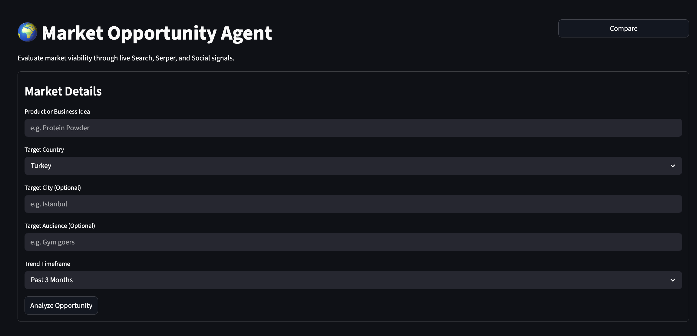
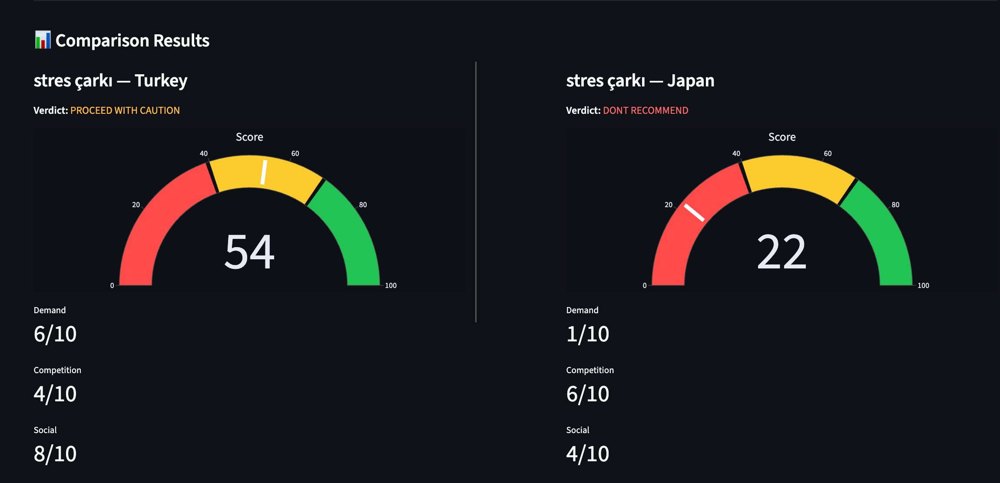

# 🌍 Market Opportunity Agent

A professional-grade, AI-driven dashboard that evaluates business viability by aggregating real-time market signals. Built with Streamlit and powered by Groq (Llama-3).





## 🚀 Features

- **Deep Market Analysis**: Combines Google Trends, Serper (Search & News), and Social Sentiment (Reddit/Quora).
- **Dynamic Timeframes**: Analyze trends from the past 30 days up to 5 years.
- **Geo-Targeting**: Localized trend analysis for major global markets.
- **Compare Mode**: Side-by-side comparison of two different ideas or markets.
- **Analysis History**: Persistent history of past analyses stored in a local SQLite database.
- **Smart Caching**: SQLite-backed persistent cache to minimize API usage and costs (7-day TTL).
- **Interactive VC Agent**: Chat with the AI about the generated report for deeper insights.
- **Export Reports**: Download full markdown reports of your analysis.

## 🛠️ Tech Stack

- **Frontend**: [Streamlit](https://streamlit.io/)
- **LLM**: [Groq](https://groq.com/) (Llama-3.3-70b-versatile)
- **Data APIs**: 
  - [SerpApi](https://serpapi.com/) (Google Trends)
  - [Serper](https://serper.dev/) (Search, News, Social)
- **Database**: SQLite (Disk Cache & History)
- **Visuals**: Plotly (Animated Gauge Charts)

## 📦 Installation

1. **Clone the repository**:
   ```bash
   git clone https://github.com/yourusername/market-opportunity-agent.git
   cd market-opportunity-agent
   ```

2. **Create a virtual environment**:
   ```bash
   python -m venv venv
   source venv/bin/activate  # Mac/Linux
   # or
   venv\Scripts\activate  # Windows
   ```

3. **Install dependencies**:
   ```bash
   pip install -r requirements.txt
   ```

4. **Setup Environment Variables**:
   Create a `.env` file in the root directory:
   ```env
   GROQ_API_KEY=your_groq_key
   SERPER_API_KEY=your_serper_key
   SERPAPI_API_KEY=your_serpapi_key
   ```

5. **Run the app**:
   ```bash
   streamlit run app.py
   ```
